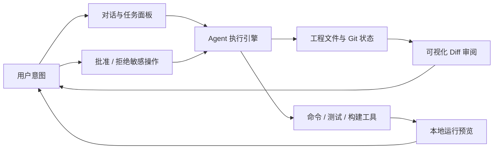

# Night24 下一阶段开发计划：可视化 Vibe Coding

> 制定日期：2026-07-01  
> 目标：把 Night24 从“聊天式 Agent 后端 + 简单聊天 UI”推进到“可视化、可审阅、可预览的本地 vibe coding 工作台”。

---

## 1. 当前项目判断

Night24 现在已经具备可继续演进的 Agent 后端底座：

- `night24-core`：已有 Agent loop、Provider 抽象、内置工具、会话、权限、安全检查、上下文压缩等核心模块。
- `night24-server`：已有 Axum HTTP 服务、`/reply` SSE、会话创建/列表/历史/重命名/fork、API Key 中间件、OpenAPI。
- `night24-mcp`：已有 memory tool 定义和内存版 store，但尚未真正接入 Agent 主工具列表。
- `tauri-app/web`：已有聊天界面、会话列表、Provider 配置、SSE 消息渲染。
- `tauri-app/src-tauri`：已有桌面壳和部分 HTTP 代理命令，但当前前端主要仍直接访问 `localhost:17787`。

这说明项目的主干已经不是“先把 Agent 跑起来”，而是需要补齐“本地工程上下文 + 可视化改动审阅 + 运行预览 + 人工确认”的产品闭环。

---

## 2. 关键缺口

### 2.1 产品体验缺口

目前 UI 仍是聊天窗口，不是编码工作台。用户看不到：

- 当前打开的是哪个工程目录。
- Agent 正在读哪些文件、改哪些文件、跑哪些命令。
- 改动前后 diff。
- 运行中的本地应用预览。
- 命令输出、测试结果、错误定位和修复进度。
- 需要确认的高风险操作。

### 2.2 后端 API 缺口

当前服务端还缺少面向可视化编码的显式 API：

- `DELETE /sessions/{id}`：前端已调用，但服务端未暴露。
- `GET /tools`：文档规划过，但服务端未暴露。
- Workspace API：打开工程、切换工作目录、读取文件树、读取文件、保存文件。
- Diff API：查看工作区变更、单文件 diff、应用/撤销补丁。
- Process API：启动/停止 dev server、测试命令、构建命令，并持续推送输出。
- Permission API：`Confirm` 目前只是枚举值，执行链没有真正暂停等待用户批准。
- Structured SSE：当前 `/reply` 基本只推送 `Message` JSON，缺少 `tool_started`、`tool_finished`、`permission_required`、`diff_ready`、`run_output`、`finish` 等事件。

### 2.3 Agent 能力缺口

Agent 已能调用工具，但还不适合直接承担可视化编码任务：

- `Session.working_dir` 创建时默认是 `"."`，没有工程选择流程。
- 文件写入是整文件写入，没有 patch/diff 优先策略。
- 工具结果是字符串，前端难以稳定渲染为文件、命令、测试、诊断等结构化视图。
- memory MCP 尚未合入 Agent 工具集合。
- 没有任务计划、执行进度、变更摘要这些面向 UI 的一等事件。

---

## 3. 产品目标

下一阶段不做“更复杂的聊天机器人”，而是做一个本地编码工作台：

核心体验：

1. 用户选择一个本地项目。
2. 用自然语言描述需求。
3. Agent 读取代码、制定简短计划、执行修改。
4. UI 实时展示工具调用、文件变化、测试结果。
5. 用户在 diff 面板审阅修改。
6. 用户启动预览或测试，Agent 根据反馈继续修。
7. 最终生成变更摘要，可提交 Git。

桌面端当前 MVP 功能范围见：`docs/desktop-current-scope.md`。

Server 职责边界见：`docs/server-definition.md`。

---

## 4. 推荐技术方向

### 4.1 保留 Rust 后端 + Tauri 桌面壳

继续使用现有 Rust 后端作为桌面桥接层，Tauri 作为本地桌面入口。Agent Core 拆为独立子进程，由 `night24-server` 通过 stdio/JSON-RPC 管理。原因：

- 可直接访问本地文件、进程、Git、端口，更适合本地 vibe coding。
- Rust 后端已有核心能力，重写成本不划算。
- stdio/JSON-RPC 不占用额外端口，适合桌面应用打包。
- `night24-server` 可以统一承载文件选择、后端生命周期、配置、权限和可视化事件桥接。
- Agent Core 崩溃或重启不会直接拖垮桌面 UI。

### 4.2 前端从单 HTML 迁移到组件化工程

建议在 `tauri-app` 内引入 Vite + React + TypeScript，后续接入：

- Monaco Editor：文件查看与编辑。
- xterm.js：命令输出和终端视图。
- diff2html 或 Monaco Diff Editor：可视化 diff。
- 简单 iframe/webview 预览：本地 dev server 预览。

后续只保留 `tauri-app` 作为主前端入口。

---

## 5. 阶段计划

## Phase 0 — 基线修复与现状收口（0.5 周）

目标：先让当前聊天 UI 和服务端契约一致，避免后续在坏接口上堆功能。

- [ ] 暴露 `DELETE /sessions/{id}`，修复前端删除会话调用。
- [ ] 暴露 `GET /tools`，返回 `builtin_tools()` 和后续 MCP tools。
- [ ] 修复前端 session 字段使用：统一使用 `name`，不再混用 `title`。
- [ ] 前端支持 `NIGHT24_API_KEY` 或用户输入 API Key header。
- [ ] `/reply` 返回明确的结束事件，避免前端只能靠连接关闭判断。
- [ ] 新增 `night24-protocol` 与 `night24-agent-core` 的拆分设计文档。
- [ ] 更新 `docs/plan-next.md`，标记已完成项和遗留项。

验收：

- `cargo build --workspace` 通过。
- `cargo test --workspace` 通过。
- Tauri 聊天、会话列表、删除、历史加载都能正常工作。

---

## Phase 1 — Workspace 基础能力（1 周）

目标：让 Night24 知道“正在操作哪个项目”，并能向 UI 提供工程结构。

后端：

- [ ] 新增 `Workspace` 模型：`id/name/root_path/created_at/last_opened_at`。
- [ ] 新增 API：
  - `POST /workspaces/open`：打开本地目录。
  - `GET /workspaces/current`：当前工程。
  - `GET /workspace/tree?path=`：文件树。
  - `GET /workspace/file?path=`：读取文件。
  - `PUT /workspace/file`：保存文件。
- [ ] 创建 session 时允许传入 `working_dir`，并持久化到 session。
- [ ] 文件路径继续强制限制在 workspace root 内。

前端：

- [ ] 增加“打开项目”入口。
- [ ] 左侧从纯会话列表升级为“项目 + 文件树 + 会话”结构。
- [ ] 点击文件可在只读编辑器中查看内容。

验收：

- 用户能选择工程目录。
- Agent 会话绑定该工程目录。
- UI 能浏览工程文件并打开文件。

---

## Phase 1.5 — Agent Core 进程拆分（1 周）

目标：让 `night24-server` 成为 Tauri 和 Agent Core 的桥梁，Agent 执行逻辑迁移到独立 stdio/JSON-RPC 子进程。

后端：

- [ ] 新增 `night24-protocol` crate，定义 JSON-RPC payload 与 `AgentEvent`。
- [ ] 新增 `night24-agent-core` binary crate。
- [ ] Core 支持 newline-delimited JSON-RPC over stdio。
- [ ] Core 实现 `core.initialize`、`agent.tools`、`agent.reply`。
- [ ] Server 新增 `AgentCoreClient`，负责启动、监控、重启 Core 子进程。
- [ ] Server `/reply` 外部接口保持不变，内部改为调用 Core。
- [ ] Core 日志只写 stderr，stdout 只写 JSON-RPC。

验收：

- 手动运行 Core，输入 JSON-RPC line 能得到合法 response。
- Server 启动时能拉起 Core。
- Tauri 调 `/reply` 行为不变。
- Core 崩溃时，Server 能向前端推送明确错误事件。

---

## Phase 2 — 结构化 Agent 事件流（1 周）

目标：让 UI 不再只能渲染聊天消息，而是能渲染执行过程。

后端：

- [ ] 定义统一事件枚举 `AgentEvent`：
  - `message_delta`
  - `message`
  - `tool_started`
  - `tool_finished`
  - `tool_failed`
  - `permission_required`
  - `diff_ready`
  - `run_output`
  - `finish`
  - `error`
- [ ] `/reply` SSE 改为具名事件或带 `type` 字段的 JSON。
- [ ] 工具执行前后发事件，包含 tool name、参数摘要、耗时、结果摘要。
- [ ] 权限 `Confirm` 改为真正暂停：发出 `permission_required`，等待用户批准/拒绝。
- [ ] 新增 `POST /permissions/{request_id}/approve` 与 `/deny`。

前端：

- [ ] 增加“执行时间线”面板。
- [ ] 工具调用卡片支持展开参数和结果。
- [ ] 敏感操作弹出确认 UI，显示命令、文件路径、风险提示。

验收：

- 执行 shell/write file 时用户能看到确认。
- 用户拒绝后工具不执行，Agent 收到拒绝结果。
- 前端能稳定展示每一步执行过程。

---

## Phase 3 — Diff 优先的代码修改闭环（1.5 周）

目标：让所有代码修改都能被审阅，而不是直接“黑盒写文件”。

后端：

- [ ] 新增 Git/文件 diff API：
  - `GET /workspace/status`
  - `GET /workspace/diff`
  - `GET /workspace/diff?path=`
  - `POST /workspace/patch/apply`
  - `POST /workspace/patch/revert`
- [ ] 增加 patch 工具：`developer__apply_patch`。
- [ ] 将 Agent 系统提示调整为“优先生成 patch，再应用 patch”。
- [ ] 文件写入工具默认降级为高风险操作，需要确认。
- [ ] 记录每轮任务的变更文件列表和 diff 摘要。

前端：

- [ ] 增加 Diff 面板。
- [ ] 支持按文件查看新增/删除/修改。
- [ ] 支持接受/撤销本轮修改。
- [ ] 支持查看 Agent 的变更摘要。

验收：

- Agent 修改代码后，用户能看到完整 diff。
- 用户能撤销本轮修改。
- 修改、测试、再修改可以形成连续闭环。

---

## Phase 4 — 运行、测试与预览（1.5 周）

目标：让用户不离开 Night24 就能看到应用运行结果。

后端：

- [ ] 新增 Process API：
  - `POST /processes/start`
  - `POST /processes/{id}/stop`
  - `GET /processes`
  - `GET /processes/{id}/logs`
- [ ] 支持预设命令：install/test/build/dev。
- [ ] 捕获 stdout/stderr 并通过 SSE 推送。
- [ ] 检测常见本地端口并返回 preview URL。
- [ ] 对长时间运行进程增加超时、停止和日志截断策略。

前端：

- [ ] 增加底部终端/日志面板。
- [ ] 增加运行按钮：测试、构建、启动预览。
- [ ] 增加预览面板，显示本地 dev server。
- [ ] 将测试失败输出转成可点击的问题条目。

验收：

- 用户能启动项目 dev server。
- UI 能显示实时日志。
- 预览面板能打开本地页面。
- Agent 可根据测试/构建错误继续修复。

---

## Phase 5 — 可视化 Vibe Coding MVP（2 周）

目标：形成一个可日常使用的最小产品。

界面布局建议：

- 左侧：项目、文件树、会话。
- 中间：聊天/任务流。
- 右侧：文件编辑器、diff、预览三 Tab。
- 底部：终端、测试、Agent 时间线。

核心工作流：

- [ ] 打开项目。
- [ ] 输入需求。
- [ ] Agent 自动分析并生成执行计划。
- [ ] 用户批准敏感操作。
- [ ] Agent 修改代码。
- [ ] 用户查看 diff。
- [ ] 用户运行测试/预览。
- [ ] Agent 根据反馈继续修复。
- [ ] 用户生成总结并提交。

附加能力：

- [ ] Git commit API 与 UI。
- [ ] 会话 fork 与当前 diff 关联。
- [ ] 工程级记忆：技术栈、启动命令、测试命令、用户偏好。
- [ ] 最近项目列表。

验收：

- 能独立完成一个小型前端页面修改任务。
- 能独立完成一个后端 bug 修复任务。
- 所有文件修改都可见、可审阅、可撤销。
- 用户无需打开外部终端即可运行测试和预览。

---

## 6. 暂不建议优先做的事

- 不优先做复杂插件市场。当前最大缺口是工作台体验，不是工具数量。
- 不优先做多 Agent 编排。单 Agent 的可视化执行闭环先跑顺。
- 不优先做云端账号体系。Night24 当前更适合本地自托管/桌面工具。
- 不优先做完整 IDE。先做“AI 修改 + diff 审阅 + 运行预览”的窄闭环。
- 不优先重写后端。现有 Rust 后端可以继续承载下一阶段。

---

## 7. 第一批任务拆分

建议从以下 PR/提交顺序开始：

1. `server-session-tools-api`
   - 增加 `DELETE /sessions/{id}`。
   - 增加 `GET /tools`。
   - 修复 OpenAPI。

2. `workspace-api`
   - 增加 workspace 模型和文件树/读文件 API。
   - session 创建支持 `working_dir`。

3. `tauri-workspace-shell`
   - Tauri 增加选择目录能力。
   - 前端增加项目入口和文件树。

4. `agent-events-v1`
   - 引入 `AgentEvent`。
   - `/reply` SSE 事件结构化。
   - 前端增加执行时间线。

5. `permission-confirmation`
   - `Confirm` 权限真正等待用户确认。
   - 前端增加批准/拒绝 UI。

6. `diff-api`
   - 增加 workspace status/diff。
   - 增加 diff 面板。

7. `process-preview-api`
   - 增加进程启动/停止/日志。
   - 前端增加终端和预览面板。

---

## 8. 风险与处理

| 风险 | 影响 | 处理 |
|---|---|---|
| Agent 直接写文件导致不可控 | 用户不信任改动 | 改为 patch/diff 优先，写文件需要确认 |
| 前端继续单 HTML 膨胀 | 后续难维护 | Tauri 主 UI 尽快组件化 |
| 进程管理失控 | 端口占用、后台残留 | 所有进程绑定 workspace/session，支持停止与清理 |
| 权限确认卡住 Agent | 体验中断 | UI 明确展示 pending 操作，并支持默认拒绝超时 |
| Windows 路径与 shell 差异 | 本地编码失败 | 路径全部后端规范化，命令预设区分平台 |
| SSE 事件演进破坏前端 | UI 不稳定 | 先定义版本化 `AgentEvent`，保持向后兼容一段时间 |

---

## 9. 下一阶段成功标准

完成 Phase 0 到 Phase 3 后，Night24 应达到“可视化代码修改 MVP”：

- 能打开本地项目。
- 能绑定会话到项目目录。
- 能看到 Agent 的读文件、写文件、命令执行过程。
- 能确认或拒绝敏感操作。
- 能看到代码 diff。
- 能撤销 Agent 的本轮修改。

完成 Phase 4 到 Phase 5 后，Night24 应达到“可视化 vibe coding MVP”：

- 能在同一窗口中聊天、看文件、看 diff、跑测试、看预览。
- Agent 能根据测试和预览反馈继续迭代。
- 用户能在提交前完整审阅所有变化。
