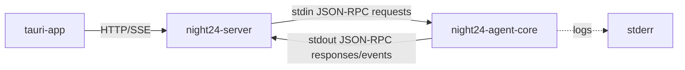

# Stdio JSON-RPC Agent Core 拆分计划

> 目标：将 Agent 执行引擎拆成独立 `night24-agent-core` 进程，由 `night24-server` 通过 stdio/JSON-RPC 管理和桥接。

## 1. 目标架构



外部 API 先保持稳定：

- Tauri 仍调用 `night24-server`。
- `/reply` 仍对前端输出 SSE。
- server 内部把请求转为 JSON-RPC 发给 Core。

## 2. Workspace 结构调整

新增：

```text
crates/
  night24-protocol/      # 共享协议类型
  night24-agent-core/    # 独立 Agent Core 进程
```

保留：

```text
crates/
  night24-core/          # Agent 领域库
  night24-server/        # 桥接层和桌面 API 网关
  night24-mcp/           # MCP 相关能力
```

## 3. 协议模型

完整协议规范见 `docs/protocol-server-agent-core-json-rpc.md`。

`night24-protocol` 首批类型：

- `JsonRpcRequest`
- `JsonRpcResponse`
- `JsonRpcNotification`
- `JsonRpcError`
- `InitializeParams`
- `ReplyParams`
- `ReplyAccepted`
- `AgentEvent`
- `PermissionRequest`
- `PermissionResolution`

首批 `AgentEvent`：

- `Message`
- `MessageDelta`
- `ToolStarted`
- `ToolFinished`
- `ToolFailed`
- `PermissionRequired`
- `Finish`
- `Error`

## 4. night24-agent-core 首版能力

首版只搬迁最小闭环：

- 读取 JSON-RPC line。
- 处理 `core.initialize`。
- 处理 `agent.tools`，返回 `builtin_tools()`。
- 处理 `agent.reply`：
  - 构造 provider。
  - 构造 session 或接收 server 传入的 history。
  - 调用 `night24_core::agent::Agent`。
  - 将返回消息转为 `agent.event` notification。
  - 最后发送 `finish`。

首版可以先不持久化 session，由 server 持久化最终消息；后续再决定 conversation 状态是否迁移到 Core。

## 5. night24-server 改造

新增 `AgentCoreClient`：

- 启动 `night24-agent-core` 子进程。
- 持有 stdin writer。
- 后台读取 stdout line。
- 分发 response 到 pending request。
- 分发 notification 到 run event channel。
- 读取 stderr 并写入 tracing 日志。

`/reply` 改造：

1. 接收前端请求。
2. 生成 `run_id`。
3. 调用 `agent.reply`。
4. 把 Core 的 `agent.event` 转成 SSE。
5. `finish/error` 后关闭 SSE。

## 6. 权限确认后续设计

Core 遇到 `PermissionLevel::Confirm` 时不直接执行工具：

1. Core 发 `permission.request` notification。
2. Server 通过 SSE 推给 Tauri。
3. 用户批准或拒绝。
4. Tauri 调 server 的 permission API。
5. Server 发 `permission.resolve` 给 Core。
6. Core 继续或返回拒绝结果给 Agent。

这一步不要求在第一批拆分中完成，但协议要预留。

## 7. 实施顺序

1. 新增 `night24-protocol` crate 和协议类型。
2. 新增 `night24-agent-core` crate，完成 stdio JSON-RPC skeleton。
3. 给 Core 增加 `agent.tools` 单元测试/进程测试。
4. server 增加子进程 client，先调用 `core.initialize`。
5. server `/tools` 通过 Core 返回工具列表。
6. server `/reply` 内部改为 Core JSON-RPC。
7. 删除 server 内直接构造 Agent 的路径。
8. 增加 Core 崩溃/重启测试。

## 8. 验收标准

- `cargo test --workspace` 通过。
- 手动启动 `night24-agent-core`，输入一行 JSON-RPC，可收到合法 JSON-RPC response。
- 启动 `night24-server` 后，它能自动拉起 Core。
- Tauri 调 `/reply` 的行为不变。
- Core 日志只出现在 stderr，不污染 stdout 协议流。
- Core 崩溃时，server 能给前端明确错误事件。
