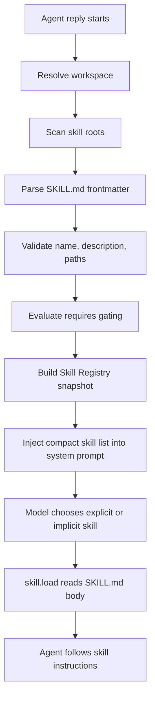

# Night24 Skill 技能系统设计

> 日期：2026-07-04  
> 状态：设计草案  
> 范围：`night24-agent-core`、`night24-server`、`tauri-app`、workspace 配置  
> 目标：先定义技能系统的边界、文件格式、加载模型、运行时接入点和阶段计划，再进入实现。

## 1. 背景

Night24 已经具备：

- `night24-server` 作为桌面端 API 网关和 Agent Core 子进程管理器。
- `night24-agent-core` 承担 provider 调用、工具执行、权限事件和 hook 执行。
- GTS 脚本引擎已原生接入，用于 GTS-only hook。
- workspace 级 hook 配置落在 `.night24/hooks.json`。

下一步需要补齐 Skill 技能系统，让 Agent 可以按需获得“可复用工作流、操作规程、领域知识、格式规范和配套脚本”，而不是把所有长期规则都塞进系统提示词。

## 2. 外部参考

### 2.1 Codex Agent Skills

Codex 将 skill 定义为可复用工作流包：一个目录包含必需的 `SKILL.md`，以及可选 `scripts/`、`references/`、`assets/`。`SKILL.md` 必须包含 `name` 和 `description`，Codex 先把技能的名称、描述和路径放入上下文，只有决定使用该技能时才加载完整说明。Codex 支持显式调用和按描述隐式匹配，并建议用 progressive disclosure 控制上下文成本。

参考：

- [Agent Skills - Codex](https://developers.openai.com/codex/skills)
- [Skills in OpenAI API](https://developers.openai.com/cookbook/examples/skills_in_api)

### 2.2 Claude / Claude Code Skills

Claude Skills 同样使用文件系统目录和 `SKILL.md`。Claude 平台文档强调三层加载：元数据常驻、正文按需加载、支持文件在需要时读取。Claude Code 还把技能做成可显式调用的命令，并支持 bundled skills、自动发现、动态上下文和控制谁可以调用。

参考：

- [Agent Skills - Claude Platform Docs](https://platform.claude.com/docs/en/agents-and-tools/agent-skills/overview)
- [Extend Claude with skills - Claude Code Docs](https://code.claude.com/docs/en/skills)
- [Anthropic Skills Repository](https://github.com/anthropics/skills)

### 2.3 OpenClaw Skills

OpenClaw 更接近 Night24 的本地 agent 形态。它把 skill 视为“教 agent 如何使用已有工具”的 `SKILL.md` 指令包，并明确区分 tool、skill、plugin：tool 负责行动，skill 负责工作流说明，plugin 负责新增运行时能力。OpenClaw 还提供多来源加载顺序、workspace / personal / managed / bundled 的覆盖规则、依赖 gating、watcher 和技能状态接口。

参考：

- [OpenClaw Skills](https://docs.openclaw.ai/tools/skills)
- [OpenClaw Creating Skills](https://docs.openclaw.ai/tools/creating-skills)
- [OpenClaw Skills Config](https://docs.openclaw.ai/tools/skills-config)
- [OpenClaw Context](https://docs.openclaw.ai/concepts/context)

## 3. 设计原则

- Skill 是“过程知识”，不是工具本体。工具负责执行动作，skill 负责告诉 Agent 在什么场景下按什么流程使用工具。
- Skill 默认不产生副作用。副作用来自 Agent 调用已有工具或显式执行 skill 配套脚本。
- Skill 使用 progressive disclosure。初始 prompt 只放紧凑元数据，正文和支持文件按需加载。
- Skill 与 hook 分工清晰。hook 是生命周期事件自动化；skill 是任务级工作流知识。
- 本地优先。workspace 技能优先于用户技能和内置技能，便于项目定制。
- 第一版不做远程市场和自动依赖安装。先把本地发现、加载、调用、管理闭环打通。
- 安全边界分阶段处理。第一版按本地受信任配置设计，但文件来源、脚本执行和依赖检查必须留出显式扩展点。

## 4. 术语

| 名称 | 含义 |
| --- | --- |
| Skill Bundle | 一个技能目录，包含 `SKILL.md` 和可选支持文件。 |
| Skill Manifest | `SKILL.md` 的 YAML frontmatter。 |
| Skill Body | `SKILL.md` frontmatter 后面的 markdown 指令正文。 |
| Skill Metadata | `name`、`description`、路径、来源、启用状态、依赖状态等紧凑信息。 |
| Skill Registry | Agent Core 每轮运行前得到的技能快照。 |
| Skill Source | 技能来源，如 workspace、project、user、bundled。 |
| Active Skill | 本轮对话已加载正文、允许 Agent 按其流程执行的技能。 |

## 5. 文件结构

推荐目录：

```text
<workspace>/
  .night24/
    hooks.json
    skills/
      code-review/
        SKILL.md
        references/
          checklist.md
        scripts/
          summarize_diff.gs
        assets/
          template.md
  .agents/
    skills/
      release-note/
        SKILL.md

~/.night24/
  skills/
    personal-style/
      SKILL.md
```

第一版支持以下技能根，按优先级从高到低：

| 优先级 | 来源 | 路径 | 说明 |
| --- | --- | --- | --- |
| 1 | workspace | `<workspace>/.night24/skills` | Night24 原生项目技能。 |
| 2 | project-agent | `<workspace>/.agents/skills` | 兼容 Codex / Claude / OpenClaw 风格项目技能。 |
| 3 | user | `$NIGHT24_HOME/skills` 或 `~/.night24/skills` | 当前用户共享技能。 |
| 4 | bundled | `crates/night24-agent-core/skills` | Night24 内置技能，后续阶段加入。 |

同名技能冲突时，高优先级覆盖低优先级。技能名来自 frontmatter `name`；缺失时可以降级使用目录名，但应产生 validation warning。

## 6. SKILL.md 格式

最小格式：

```markdown
---
name: code-review
description: Review code changes for bugs, regressions, security risks, and missing tests.
---

# Code Review

When the user asks for a review, inspect the diff first. Prioritize findings by severity.
Return findings before summaries.
```

扩展格式：

```markdown
---
name: release-note
description: Draft concise release notes from git history and workspace diff.
version: 1
enabled: true
user_invocable: true
model_invocable: true
tags: ["git", "docs", "release"]
requires:
  os: ["windows", "linux", "macos"]
  bins: ["git"]
  tools: ["read_file", "shell"]
  features: ["gts"]
allowed_tools: ["read_file", "shell"]
script_engine: "gts"
---

# Release Note

1. Inspect commits and changed files.
2. Group changes by user-facing impact.
3. Mention migration or compatibility notes.

Use `{baseDir}/references/style.md` when present.
```

### 6.1 必填字段

| 字段 | 规则 |
| --- | --- |
| `name` | 小写字母、数字、短横线，建议与目录名一致。 |
| `description` | 一句话说明何时使用、何时不要使用；用于模型匹配和桌面展示。 |

### 6.2 可选字段

| 字段 | 默认 | 说明 |
| --- | --- | --- |
| `version` | `1` | manifest 版本。 |
| `enabled` | `true` | 是否启用。 |
| `user_invocable` | `true` | 是否允许用户显式调用。 |
| `model_invocable` | `true` | 是否出现在模型可见技能列表中。 |
| `tags` | `[]` | 桌面端筛选和搜索。 |
| `requires.os` | `[]` | 操作系统 gating。 |
| `requires.bins` | `[]` | PATH 中必须存在的可执行文件。 |
| `requires.env` | `[]` | 必须存在的环境变量或配置项。 |
| `requires.tools` | `[]` | Agent 必须可用的工具。 |
| `requires.features` | `[]` | 需要的 Night24 功能，如 `gts`、`mcp`。 |
| `allowed_tools` | `null` | 可选工具提示，不在第一版强制拦截。 |
| `script_engine` | `null` | 支持文件脚本建议使用的引擎，第一版只认 `gts`。 |

## 7. 加载模型



### 7.1 Skill Registry 快照

Agent Core 在每个 `agent.reply` 开始时构建一次技能快照。后续可以加 watcher，但运行中的 run 不热替换技能，避免同一轮上下文前后不一致。

快照字段：

```json
{
  "skills": [
    {
      "name": "code-review",
      "description": "Review code changes for bugs, regressions, security risks, and missing tests.",
      "source": "workspace",
      "path": "E:/project/.night24/skills/code-review/SKILL.md",
      "enabled": true,
      "eligible": true,
      "missing": [],
      "user_invocable": true,
      "model_invocable": true
    }
  ],
  "warnings": []
}
```

### 7.2 Prompt 注入

系统提示词只注入紧凑列表：

```text
Available skills:
- code-review: Review code changes for bugs, regressions, security risks, and missing tests. Path: skill://code-review
- release-note: Draft concise release notes from git history and workspace diff. Path: skill://release-note

Use a skill when its description matches the task. Load the full instructions before following the skill.
```

控制预算：

- 第一版技能列表上限 8 KB。
- 超出预算时优先截断 description，再按来源优先级和名称稳定排序保留。
- 被省略的技能在桌面端状态中展示 warning。

## 8. 调用方式

### 8.1 显式调用

支持两种语法：

```text
$code-review 检查当前改动
/skill code-review 检查当前改动
```

Server 或 Agent Core 在进入模型前识别显式调用：

- 验证技能存在、启用、eligible、允许用户调用。
- 将该技能标记为 active。
- 将 `SKILL.md` 正文注入本轮上下文，或让模型第一步调用 `skill.load`。

第一版建议选择“显式调用直接注入正文”，降低工具调用复杂度。

### 8.2 隐式调用

隐式调用依赖 description。模型看到紧凑技能列表后，如果认为某个技能匹配任务，应调用内置工具：

```json
{
  "name": "skill_load",
  "arguments": {
    "name": "code-review"
  }
}
```

`skill_load` 是 Agent Core 内置工具，只能读取 registry 中已启用、eligible 的技能正文和支持文件，不允许任意文件路径。

### 8.3 支持文件读取

支持 `{baseDir}` 占位符，但不要求模型知道真实文件系统路径。建议通过工具读取：

```json
{
  "name": "skill_load",
  "arguments": {
    "name": "code-review",
    "file": "references/checklist.md"
  }
}
```

规则：

- `file` 必须是 skill bundle 内的相对路径。
- 禁止 `..`、绝对路径、符号链接逃逸。
- 第一版只读文本文件；二进制 assets 后续支持。

## 9. 与 GTS 脚本引擎的关系

Skill 可以携带脚本，但脚本不是自动执行入口。Agent 必须在技能说明中明确何时运行脚本。

推荐：

```text
skills/code-review/
  SKILL.md
  scripts/
    summarize_diff.gs
```

后续新增内部工具：

```json
{
  "name": "skill_run_gts",
  "arguments": {
    "skill": "code-review",
    "script": "scripts/summarize_diff.gs",
    "args": {
      "working_dir": "E:/project"
    }
  }
}
```

执行模型：

- 复用现有 GTS 运行时能力。
- 第一版可与 hook 共用“单 worker 串行执行”的工程约束，但建议抽出 `GtsScriptRunner`，由 hooks 和 skills 分别调用。
- 脚本返回结构化结果：

```json
{
  "outputs": [
    { "stream": "stdout", "text": "summary" }
  ],
  "data": {
    "files": 3,
    "risk": "medium"
  }
}
```

## 10. 与 Hook 系统的关系

Skill 与 hook 不互相替代：

- hook 自动响应生命周期事件，例如 `before_provider_request`、`before_tool`。
- skill 由用户或模型按任务选择，提供工作流指令和支持脚本。

建议扩展 hook context：

```json
{
  "event": "before_provider_request",
  "active_skills": ["code-review"],
  "available_skill_count": 12
}
```

后续可新增 hook 事件：

- `skill_loaded`
- `skill_script_started`
- `skill_script_finished`
- `skill_script_failed`

第一版不阻塞在这些新增事件上，只需要让现有 hook 能看到 active skill 信息。

## 11. Server API 设计

### 11.1 查询技能状态

```text
GET /workspace/skills
```

返回：

```json
{
  "workspace": {
    "root_path": "E:/project"
  },
  "skills": [
    {
      "name": "code-review",
      "description": "...",
      "source": "workspace",
      "path": "E:/project/.night24/skills/code-review/SKILL.md",
      "enabled": true,
      "eligible": true,
      "missing": []
    }
  ],
  "warnings": []
}
```

### 11.2 读取技能正文

```text
GET /workspace/skills/{name}
```

返回 `SKILL.md` frontmatter、body、支持文件索引和 validation 结果。

### 11.3 创建或更新 workspace 技能

```text
PUT /workspace/skills/{name}
```

仅写入 `<workspace>/.night24/skills/{name}/SKILL.md`。不在第一版写用户全局技能，避免桌面端误改全局环境。

### 11.4 删除或禁用

第一版建议只支持禁用，不直接删除：

```text
PATCH /workspace/skills/{name}
```

将 frontmatter `enabled: false` 写回，或写入 `.night24/skills.disabled.json`。推荐前者，简单直观。

## 12. Agent Core 接入点

建议新增模块：

```text
crates/night24-agent-core/src/
  skills.rs
```

核心类型：

```rust
struct SkillRegistry {
    skills: Vec<SkillRecord>,
    warnings: Vec<SkillWarning>,
}

struct SkillRecord {
    name: String,
    description: String,
    source: SkillSource,
    manifest_path: PathBuf,
    base_dir: PathBuf,
    enabled: bool,
    eligible: bool,
    missing: Vec<String>,
    user_invocable: bool,
    model_invocable: bool,
}

enum SkillSource {
    Workspace,
    ProjectAgent,
    User,
    Bundled,
}
```

Agent loop 变化：

1. `agent.reply` 收到 `working_dir`。
2. `SkillRegistry::load(working_dir)` 扫描技能。
3. 解析用户输入中的显式 skill 调用。
4. 构建 system prompt 时加入紧凑 skill list。
5. 显式 skill 的正文加入本轮 prompt。
6. 隐式 skill 通过 `skill_load` 工具按需读取。
7. active skills 写入 run state，供 hooks、events、debug 使用。

## 13. Desktop 管理模块

设置页新增“技能”tab：

- 展示技能列表：名称、来源、启用状态、eligible、缺失依赖。
- 支持按来源筛选。
- 支持打开 / 编辑 workspace 技能。
- 支持新建技能模板。
- 支持禁用 workspace 技能。
- 支持刷新技能扫描结果。
- 支持查看支持文件索引。

第一版不做：

- ClawHub / marketplace。
- 远程安装。
- 自动安装依赖。
- 大型富文本编辑器。

## 14. 安全与信任

Skill 本体是 prompt 和本地文件。风险来自：

- 恶意指令诱导 Agent 调用危险工具。
- skill scripts 调用 GTS 标准库访问文件、网络或本地命令。
- 第三方技能伪装成常用 workflow。
- 描述过宽导致模型误触发。

第一版策略：

- workspace 和 user 技能视为本地受信任配置。
- `skill_load` 只能读取 registry 内技能目录，不能逃逸。
- `skill_run_gts` 只能运行当前 skill bundle 内脚本。
- 显示技能来源和路径。
- disabled / missing dependency 的技能不进入模型可见列表。
- 对 unsupported frontmatter 给 warning，不静默失败。

后续策略：

- 技能 trust level：`trusted`、`workspace`、`third_party`。
- 第三方技能安装前审核。
- hash / lockfile。
- allowlist tool policy 强制执行。
- scripts sandbox 和模块 allowlist。

## 15. 阶段计划

### Phase 1: 本地 Skill Registry MVP

- 新增 `skills.rs`。
- 扫描 `.night24/skills`、`.agents/skills`、`~/.night24/skills`。
- 解析 `SKILL.md` frontmatter 和 body。
- 生成 registry 快照。
- 注入紧凑技能列表。
- 支持 `$skill-name` 显式调用并注入正文。
- 提供 `GET /workspace/skills`。

验收：

- workspace 技能优先于 user 技能。
- disabled 或缺少依赖的技能不会进入模型可见列表。
- description 出现在 prompt，body 不会默认进入 prompt。
- 显式 `$code-review` 能加载完整正文。

### Phase 2: skill_load 工具与支持文件

- 新增 `skill_load` 内置工具。
- 支持按需读取 `SKILL.md` body。
- 支持读取 `references/` 下文本文件。
- 增加路径逃逸测试。
- 在 event / timeline 中展示 `skill_loaded`。

验收：

- 模型可隐式选择技能并读取正文。
- `{baseDir}` 文档指向的支持文件可被安全读取。
- 非 skill 目录文件无法读取。

### Phase 3: 桌面技能管理

- Settings 增加“技能”tab。
- 支持新建、编辑、禁用、刷新 workspace 技能。
- 展示 source、eligible、missing requirements、warnings。
- 支持技能模板：空技能、代码审查、发布说明、GTS 脚本型技能。

验收：

- 用户不用手写目录也能创建 workspace skill。
- 修改 `SKILL.md` 后刷新可见。
- 错误 frontmatter 在 UI 中清楚显示。

### Phase 4: GTS skill scripts

- 抽出共享 `GtsScriptRunner`。
- 新增 `skill_run_gts`。
- 支持结构化返回 `outputs` 和 `data`。
- 与 hook 输出统一进入 run timeline。

验收：

- skill 脚本可接收结构化 args。
- 脚本输出以 `skill:<name>:<script>` source 展示。
- 脚本错误非致命，并进入 stderr timeline。

### Phase 5: 安全、分发和治理

- 引入 trust level。
- 支持技能 lockfile 和 hash。
- 支持导入本地目录或 zip，但默认需要用户确认。
- 支持 tool allowlist 强制执行。
- 后续再考虑 registry / marketplace。

## 16. 测试计划

Agent Core：

- 解析合法 `SKILL.md`。
- 缺失 `name` / `description` 给 warning。
- 同名技能按优先级覆盖。
- disabled 技能不注入。
- requires gating 生效。
- 技能列表预算截断稳定。
- 显式调用识别 `$name` 和 `/skill name`。
- `skill_load` 禁止路径逃逸。

Server：

- 无 workspace 时 `/workspace/skills` 返回 409。
- 有 workspace 时返回技能状态。
- PUT 只写 `.night24/skills/{name}/SKILL.md`。
- 非法 name 被拒绝。

Desktop：

- 无 workspace 展示空态。
- 技能列表、错误状态、缺失依赖可见。
- 新建和保存 workspace 技能后能刷新读取。

## 17. 关键决策

- Night24 原生技能根使用 `.night24/skills`。
- 同时兼容 `.agents/skills`，方便复用 Codex / Claude / OpenClaw 风格项目技能。
- 第一版显式调用直接加载正文，隐式调用通过后续 `skill_load` 工具完善。
- 技能脚本优先使用 GTS，不引入 command skill。
- 技能不直接绕过权限系统；它只是提示 Agent 如何使用已有工具。
- 安全治理后置，但路径逃逸和 disabled / gating 必须第一版就做。

## 18. 待确认问题

- 用户显式调用最终统一使用 `$skill`，还是同时保留 `/skill name`？
- 技能正文注入是否应记录到会话历史，还是只作为运行时 prompt 片段？
- `allowed_tools` 第一版是否只作为提示，还是需要立刻接入工具策略？
- user 技能根是否使用 `~/.night24/skills`，还是兼容 `$CODEX_HOME/skills` / `~/.agents/skills`？
- bundled skills 是否跟随 binary 编译进资源，还是作为仓库目录随安装分发？
