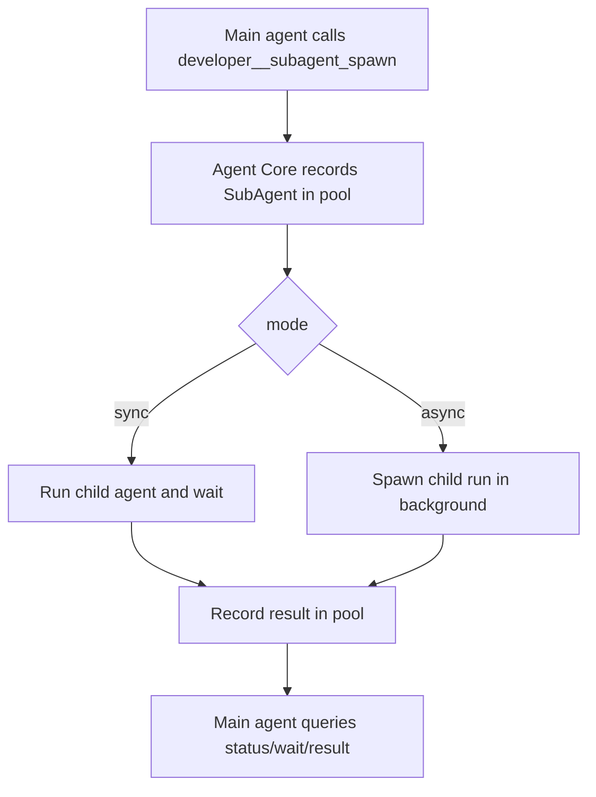

# Night24 Sub-agent 子代理系统设计

> 日期：2026-07-04  
> 状态：实现导向设计  
> 范围：`night24-agent-core`、`night24-core` 工具定义、后续 server/desktop 状态展示

## 1. 目标

子代理系统需要满足：

- 主 agent 能在推理过程中主动、自主创建子代理。
- 子代理支持同步执行和异步执行。
- 主 agent 与子代理之间有通讯机制。
- Agent Core 维护子代理池，主 agent 能查询状态并管理池内子代理。

## 2. 核心决策

- 子代理能力作为 Agent Core 原生工具暴露给模型，而不是只做 server API。
- 子代理池存在于 `AgentCore` 进程内，按当前 Core 生命周期管理。
- 子代理执行复用现有 `agent.reply` 运行循环、provider、tool、hook、permission 模式。
- 同步子代理：`subagent_spawn(mode="sync")` 创建并等待结果。
- 异步子代理：`subagent_spawn(mode="async")` 立即返回 `subagent_id`，后台执行。
- 通讯机制第一版采用 mailbox：主 agent 可向子代理发消息，子代理可向父代理发消息，双方可通过状态工具读取消息。

## 3. 工具接口

### 3.1 `developer__subagent_spawn`

创建子代理。

参数：

```json
{
  "task": "分析当前 diff 的潜在风险",
  "mode": "async",
  "name": "risk-reviewer",
  "max_turns": 4,
  "timeout_ms": 120000,
  "provider": "echo",
  "model": "echo-v1"
}
```

返回：

- `mode=async`：返回子代理 ID 和当前池状态。
- `mode=sync`：等待子代理完成，返回子代理 ID、状态、结果。

### 3.2 `developer__subagent_status`

查询子代理池状态。

参数：

```json
{
  "subagent_id": "subagent-...",
  "include_messages": true,
  "include_result": true
}
```

`subagent_id` 省略时返回整个池。

### 3.3 `developer__subagent_message`

发送消息。

主 agent 调用时必须指定 `subagent_id`，消息方向为 `parent_to_child`。子代理调用时如果不指定 `subagent_id`，消息方向为 `child_to_parent`。

参数：

```json
{
  "subagent_id": "subagent-...",
  "message": "补充检查 hooks 相关文件"
}
```

### 3.4 `developer__subagent_wait`

等待异步子代理完成。

参数：

```json
{
  "subagent_id": "subagent-...",
  "timeout_ms": 60000
}
```

### 3.5 `developer__subagent_cancel`

取消子代理。省略 `subagent_id` 时取消当前池内所有运行中的子代理。

参数：

```json
{
  "subagent_id": "subagent-..."
}
```

## 4. 池状态模型

```json
{
  "subagents": [
    {
      "id": "subagent-...",
      "name": "risk-reviewer",
      "status": "running",
      "mode": "async",
      "parent_run_id": "run-1",
      "child_run_id": "run-1:subagent:subagent-...",
      "task": "分析当前 diff 的潜在风险",
      "created_at": "2026-07-04T12:00:00Z",
      "updated_at": "2026-07-04T12:00:01Z",
      "message_count": 1,
      "result_preview": null,
      "error": null
    }
  ]
}
```

状态：

- `queued`
- `running`
- `completed`
- `failed`
- `cancelled`

## 5. 执行模型



## 6. 后续扩展

- Server API：`GET /agent/subagents`、`POST /agent/subagents/{id}/cancel`。
- Desktop：运行时间线增加子代理池视图。
- Skill：`subagent_spawn` 可指定 skill profile。
- 权限：子代理可拥有独立 permission mode 和 tool allowlist。
